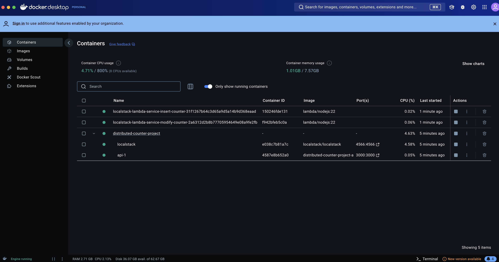
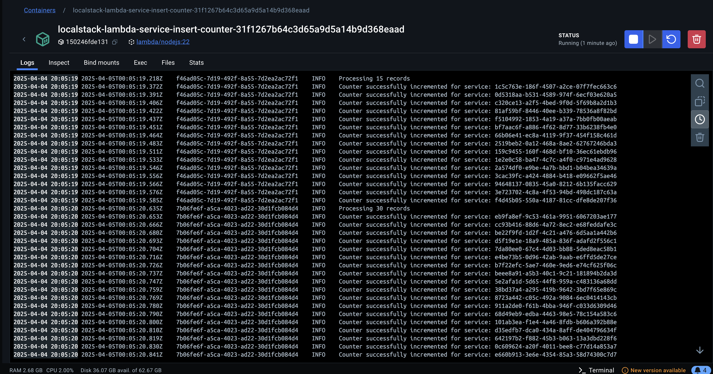
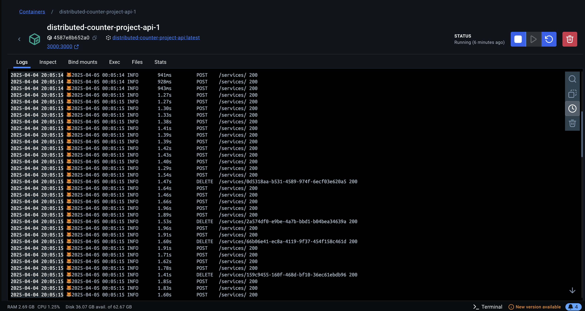
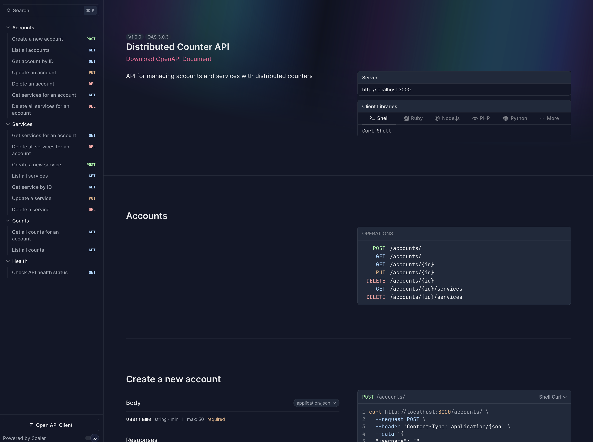
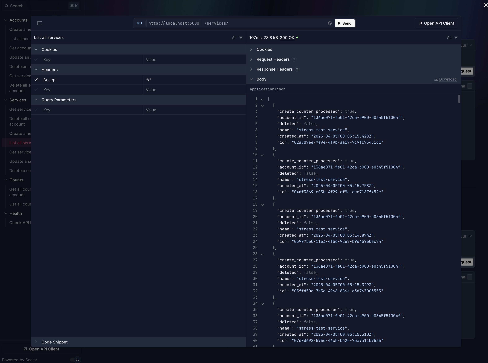

# High Throughput Distributed Counter

## Problem Description

DynamoDB's current approaches to atomic counters present significant challenges to high-throughput demands.

DynamoDB achieves atomicity through transactions that use an optimistic concurrency control scheme without locks. As a result, transactions do not wait for other transactions to finish before executing and instead fail when contention occurs. The DynamoDB client uses a retry mechanism with exponential backoff and jitter to resolve these transaction failures, but when the maximum number of retries allowed by the client is exceeded the failure will propagate to the caller. While the potential TPS for transactions with DynamoDB's internal retry strategy is extremely high, there is a non-zero chance that transaction failure errors can propagate to the caller due to transactions that operate on hot partitions. 

Many existing products cannot tolerate transaction failures because their API contracts do not include error handling for these specific failure modes. Adding new error types would require releasing a new major version of their API, breaking backward compatibility with existing users. This poses a significant business risk for companies with established user bases, requiring clients to update their integration code simultaneously or risk service disruption. 

Existing solutions are incomplete and come with their own disadvantages. Distributed sharded counters reduce but do not fully eliminate contention issues, leaving the product vulnerable to failure. Eventual consistency counters avoid transaction failures but introduce unacceptable latency for applications requiring real-time counter updates. This latency is particularly problematic for services that enforce limits on user actions, such as an API that restricts the number of items a user may create in their account. When a user approaches their limit, the counter must reflect accurate values immediately to prevent limit violations. Eventually consistent counters might allow users to temporarily exceed their allotted limit during the consistency window, creating compliance issues and potentially costly overages that cannot be billed to customers due to API contract limitations.
The industry has a need for a counter solution that provides the immediacy of transactional atomic counters while maintaining DynamoDB's promise of limitless scalability and existing API contracts.

## Our Solution

Our solution uses both a best-effort counter and an eventual consistency counter. The eventual consistency counter is eventually-accurate and is processed through Lambda functions that consume a DynamoDB stream. The best effort counter may undercount but cannot overcount, healing itself when all services are deleted, and it is reset to zero.  Since the best effort counter may only ever undercount or be accurate, the maximum of the best effort counter and the eventually consistent counter is used to enforce creation limits. This serves as an immediate heuristic until the eventually consistent counter catches up. 

This design maximizes limit utilization but introduces a small risk of temporarily exceeding limits if the best effort counter undercounts by a significant amount and the eventually consistent counter has not yet stabilized. 

During rapid resource creation, the best-effort counter value typically dominates as it updates immediately. This approach is optimal for scenarios where accurate counting is necessary and where minor, temporary limit overages are acceptable. 

This approach guarantees limits are never exceeded but may prevent full utilization of available resources until the eventually consistent counter stabilizes. Additional research is needed to determine optimal synchronization intervals between counters and viable strategies to "heal" the best-effort counter. 

The code contained in this repository constitutes all current code for our working solution.

## Requirements

- [Docker](https://www.docker.com)
- [bun](https://bun.sh/)
- [K6](https://k6.io/)
- [Node.js](https://nodejs.org/en)
- [npm](https://www.npmjs.com/)
- [AWS SAM CLI](https://aws.amazon.com/serverless/sam/)
- [AWS CLI](https://aws.amazon.com/cli/)

## Usage

### Run Containers

```sh
docker compose up
```

### Shut Down Containers

```sh
docker compose down -v --remove-orphans
```

### Grant Execution Privileges to The Shell Scripts

```sh
chmod +x infrastructure/deploy-cloudformation.sh && \
chmod +x infrastructure/teardown-cloudformation.sh && \
chmod +x lambda/package-lambdas.sh
```

### Deploy Local AWS Infrastructure

Note that the Docker containers must be running

```sh
./infrastructure/deploy-cloudformation.sh
```

### Tear Down Local AWS Infrastructure

Note that the Docker containers must be running

```sh
./infrastructure/teardown-cloudformation.sh
```

### Upload Lambda Functions

```sh
./lambda/package-lambdas.sh
```

### Load Tests

Run constant rate tests

```sh
k6 run load-tests/constant-rate-test.js
```

## Running The Program

Execute the commands from the Usage section in the following order

1. Grant Execution Privileges to The Shell Scripts
2. Run Containers
3. Upload Lambda Functions
4. Deploy Local AWS Infrastructure

## Viewing Local Logs

Logs are aggregated to CloudWatch, but when running the program locally, all logs are accessible by
viewing the log groups in their respective Docker containers.

Here's an example of the Docker containers:



Here's an example of the Lambda logs, shown by entering a Lambda container:



Here's an example of the Elysia API logs, shown by entering the API container:



## Accessing The API Explorer

The API explorer can be accessed at the `swagger` route. For instance, if running the API locally,
the API explorer can be accessed at [http://localhost:3000/swagger](http://localhost:3000/swagger)
and should look something like this:



Here's an example of using the API explorer to make a call



## Deploying to AWS

Here's an infrastructure diagram depicting this system when run on AWS:


## Known Issues

LocalStack is finicky, and sometimes DynamoDB streams appear to be created as Kinesis streams instead
of DynamoDB streams. If you're getting an error like `An error occurred (InvalidParameterValueException) when calling the CreateEventSourceMapping operation: Stream not found: arn:aws:dynamodb:us-east-1:000000000000:table/distributed-counter/stream/2025-03-28T17:36:19.565`, when deploying Lambda functions, then you're
likely encountering [this issue](https://github.com/localstack/localstack/issues/10885). Try deleting
 your `docker-volumes` folder and re-running `docker compose up --build` to build fresh containers.

## Dataflow

The dataflow for a given Entity is:

Entity (Database table) -> EntityRepository -> EntityService -> entities (plural as route)

For instance, the Account data type has an Account table in the DynamoDB. An AccountRepository.ts file interacts with this table in the DynamoDB. An AccountService.ts performs input validation before calling low-level operations from AccountRepository.ts. Finally, account.ts exists in the routes folder and exposes RESTful methods that call operations from AccountService.ts.
